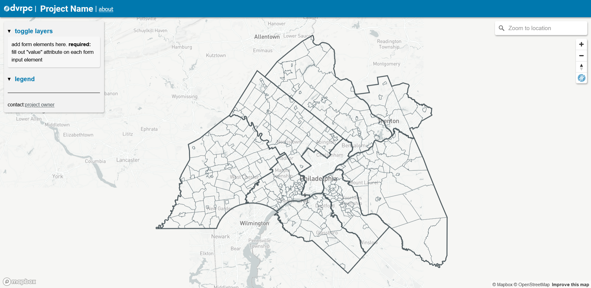

# Simple Toggles Webmap Template

Copy this template to bootstrap a webmap with an overlay containing a form and legend area. Useful for projects with togglable and/or clickable layers that don't need space for text or data content (with the exception of project info, which can go in the about modal).
  
This template is new so no samples are deployed yet, but you can view [a working demo here]().

## Includes
- Config for forms, legends and layers to easily add map sources, layers, layer toggles and legend info
- Mapbox geocoder to search + zoom to
- About modal to provide additional information about the app
- DVRPC icon map overlay to easily re-orient view to the DVRPC region
- webpack config that outputs compiled project to `/build/`
- Responsive design

## Getting Started
- Copy directory to project root 
- `npm install`
- Spin up a local server ([live server plugin](https://marketplace.visualstudio.com/items?itemName=ritwickdey.LiveServer) for vscode) from root to launch project
- Add default map layers to `/js/map/mapLayers.js`
    - default map layers are visible after the initial page load. DVRPC County and municipal boundaries are included with the template
- Add secondary map layers to `/js/map/secondaryMapLayers.js`
    - secondary map layers aren't visible until they are toggled on by a user
- Add legend information to `/js/legendConfig.js`
- Add toggles within the `<form id="toggle-form>` element in the sidebar.<strong> make sure to set toggle `value` attribute to its respective layer id, defined in either `mapLayers.js` or `secondaryMapLayers.js`</strong>
- The rest of the content, actions and styles are up to you. Happy hacking

## Deployment
- `npm run build`
- copy files from `/build/` folder to deployment folder
- to ensure cache busting, change css file names and corresponding `<link>` paths in `index.html`

## Demo
- spin up or browse through the `/demo/` folder to get a sense of how everything hooks up to make a working map.