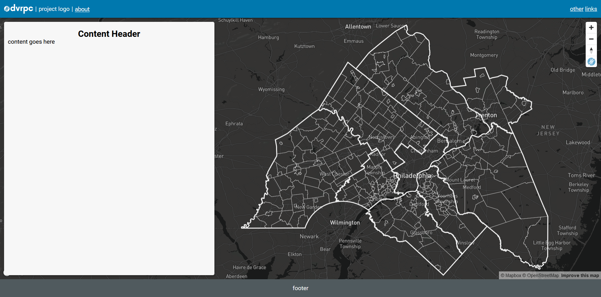
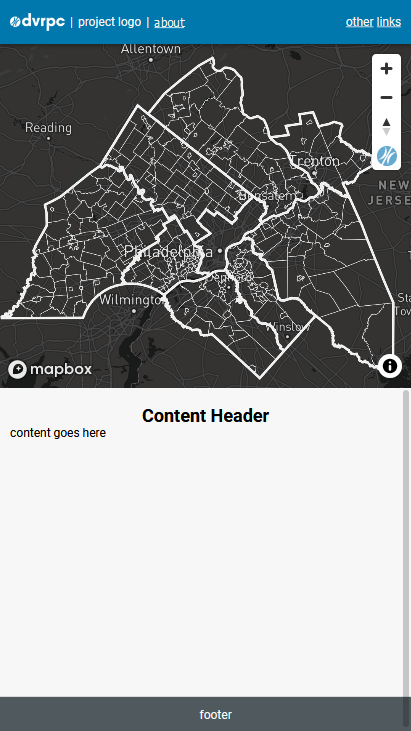

# Floating, responsive webmap template with full width footer

## Includes
    - about modal (add tabs by pulling code from tabs folder)
    - DVRPC extent map overlay to easily re-orient view to the DVRPC region
    - easily append or update map sources and layers

## Getting Started
    - copy folder as root (or folder contents into root) of project folder
    - spin up a local server (live server plugin if using vscode)
    - that's it. Mapbox is the only external source, everything else is vanilla. The rest of the content and styles are up to you. Happy hacking. 

## Output (desktop)

## Output (mobile)
