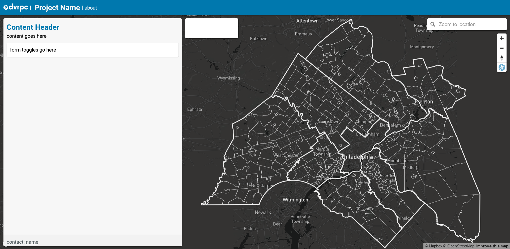

# Floating, responsive webmap template

## Includes
- About modal (add tabs by pulling code from tabs folder)
- DVRPC extent map overlay to easily re-orient view to the DVRPC region
- Mapbox geocoder to search + zoom to
- Config for forms, legends and layers to easily add map sources, layers and legend info

## Getting Started
- Copy folder as root (or folder contents into root) of project folder
    - do not include demo folder. Remove if automatically included. 
- Spin up a local server (live server plugin if using vscode)
- Add default map layers to `mapLayers` in the js folder (i.e. any layer that's part of the initial load)
- Add secondary map layers (i.e. any layer that isn't part of the initial load) to `secondaryMapLayers` in the js folder
- Add legend information to `legendConfigs` in the js folder
- Add toggles within the `form` element in the `overlay` component.<strong> make sure to set toggle `value` attribute to its respective layer id, defined in either `mapLayers` or `secondaryMapLayers`</strong>
- The rest of the content and styles are up to you. Happy hacking. 

## Demo
- browse through the demo folder to get a sense of how everything hooks up to make a working map.
- [View live demo here]()
- desktop preview:
